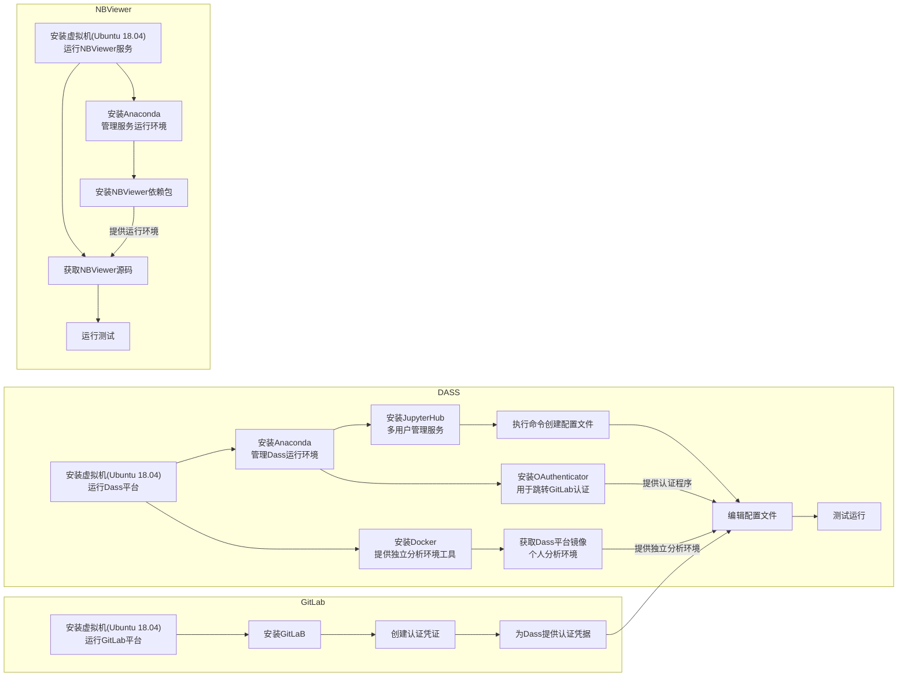

# DASSLab 服务部署文档

## DASSLab 部署流程图



## DASSLab 部署描述

**服务说明**

上图对部署DASSLab平台的主要部分进行划分，目前主要分为三台机器运行，分别运行：

+ DASSLab 分析平台，提供多用户管理、用户环境管理等
+ GitLab 平台，提供多用户认证、Git仓库、Git仓库可视化管理等
+ NBViewer服务，提供分析报告展示服务

**系统说明**

目前采用底层虚拟化技术 ESXI ，在 ESXI 上层构建虚拟机，目前所有虚拟机全部使用 Ubuntu 系统部署，详细版本为Ubuntu 18.04 LTS 版本，可选桌面版和服务版。镜像下载地址([桌面版](<https://ubuntu.com/download/desktop>)、[服务版](<https://ubuntu.com/download/server>))，ESXI 安装虚拟机参见[在VShape Client中创建虚拟机](<https://docs.vmware.com/cn/VMware-vSphere/6.0/com.vmware.vsphere.hostclient.doc/GUID-7834894B-DD17-4D59-A9BF-A33D02478521.html>)，安装完成后建议更新一下系统运行环境，命令为 `sudo apt update && sudo apt upgrade` 。

**Anaconda 说明**

Anaconda 是及 Python 环境、数据分析组件、虚拟环境管理等一体的工具，使用方便、快捷，可极大程度减少系统环境和程序运行环境等原因造成的 BUG 。

## 部署详述

对流程图中步骤进行信息描述。

### NBViewer

NBVIewer 服务主要用于提供在线展示分析报告，所需机器配置不需要太高。

在系统完成后进行安装 Anaconda 以及获取 NBViewer 源码，不分先后顺序。

#### 安装Anaconda

- 下载 Anaconda [安装文件](<https://www.anaconda.com/distribution/>)
- 执行安装命令 `bash ./Anaconda安装文件` ，以个人环境安装不需要使用 `sudo` 命令
- 确认初始化环境变量，Anaconda 安装将自动在个人用户 `home` 目录下的 `.bashrc` 文件中加载环境变量。如选择则否，可自行在 `.bashrc` 文件中添加以下环境变量命令： `export PATH="/home/username/anaconda3/bin:$PATH"`
- 确认Anaconda安装，1: 在命令行中输入 conda 命令，出现 conda 命令帮助文档即为成功。2:手动确认`.bashrc`文件中是否存在上一步的环境变量，并且在该路径存在内容

#### 安装NBViewer 运行依赖

运行NBViewer源码需要提供运行环境，使用 conda 命令进行安装所需的运行环境，命令格式: `conda install packag_name` 。目前除去 Anaconda 初始环境中所携带的运行包后，所依赖的包名有:

```
makedown # python makedown 格式包
statsd  # 
tornado # Python Web 应用框架
pylibmc # 分布式内存对象缓存系统
```


#### 获取NBViewer 源码

[NBViewer源码地址](http://192.168.3.200/lab_dev/nbviewer_meta.git)存在内部GitLab仓库中，也可通过 `git` 命令进行获取： `git clone http://192.168.3.200/lab_dev/nbviewer_meta.git` 。

#### 测试运行

上述步骤完成后，我们即可测试运行，进入获取到的 NBViewer 源码目录下，使用以下命令进行运行： `python3 -m nbviewer` 。

如出现以下提示:

```shell
I 190923 10:46:27 app:124] Not indexing notebooks
[I 190923 10:46:27 app:144] Using in-memory cache
[I 190923 10:46:27 app:348] Listening on 0.0.0.0:5000, path /
```

则为启动成功，可通过浏览器访问 NBViewer 部署机器 IP 地址加端口进行测试访问。例：`http://192.168.3.80:5000`.

如出现报错提示，可通过所打印的日志进行确认原因。缺少依赖则通过 conda 进行安装。

进行到此处即为安装成功，NBViewer 详细配置另做描述，本文档不做介绍。

### DASSLab 分析平台

DASSLab 主要承担用户分析计算，所以性能要求较高，在创建虚拟机是需要分配较高的运算核心、内存以及适当的存储空间。

在系统完成后进行安装 Anaconda 以及安装 Docker ，不分先后。

#### 安装Docker

Docker 官网提供了 Ubuntu 安装方式，均为最新版。为保持稳定，我们选择使用 Ubuntu 源中相对较早的版本，同样也是最为简单的安装方式，执行以下命令进行安装：

```shell
sudo apt update && sudo apt install docker.io
```

安装完成后进行配置非 `root` 用户使用 `docker` 命令。

1. 确认用户组中有没有 `docker` 小组: `cat /etc/group | grep docker ` 
2. 如没有 docker 组，则进行创建： `sudo groupadd docker` 。如有则执行下一步
3. 将用户添加到 docker 组中：`sudo usernamed -a G docker username` 
4. 最后完成后，重启 docker (`sudo systemctl restart docker `)以及计算机，待开机后，在命令行中输入`docker ps`  

如果显示帮助文档即为安装成功，如不成功可根据报错日志进行排查，权限不足可可将上述配置步骤再次执行。

Docker配置完成后需要获取 DassLab 平台的个人用户基础镜像，为用户提供独立的环境和独立的存储空间。

#### 获取 Dass 个人用户镜像

[镜像地址](<https://cloud.docker.com/u/sunxr/repository/docker/sunxr/dass>)，获取镜像命令格式： `docker pull imagename:version` ，目前使用的版本为 `dass:0.5` 版本，获取命令为： `docker pull sunxr/dass:0.5` 

#### 安装Anaconda

+ 下载 Anaconda [安装文件](<https://www.anaconda.com/distribution/>) 
+ 执行安装命令 `bash ./Anaconda安装文件` ，以个人环境安装不需要使用 `sudo` 命令。
+ 确认初始化环境变量，Anaconda 安装将自动在个人用户 `home` 目录下的 `.bashrc` 文件中加载环境变量。如选择则否，可自行在 `.bashrc` 文件中添加以下环境变量命令： `export PATH="/home/username/anaconda3/bin:$PATH"` 
+ 确认 Anaconda 安装，1: 在命令行中输入 conda 命令，出现 conda 命令帮助文即为成功。2:手动确认 `.bashrc` 文件中是否存在上一步的环境变量，并且在该路径存在内容。

#### 安装JupyterHub

JupyterHub 提供分析平台的多用户管理应用，可通过 conda 命令直接安装`conda install jupyterhub`，等候安装完成。执行`jupyterhub --help`命令出现帮助文档即为安装成功。

#### 生成配置文件

在安装完成后，需要进行生成配置文件，在配置文件中进行自定义配置。

默认 JupyterHub 生成配置文件命令会在执行命令的当前路径下创建配置文件，如需独立的管理配置文件，需要进行创建存放路径，可通过 `mkdir` 命令进行创建目录。创建后进入目录下执行创建命令： `jupyterhub --generate-config` 

#### 安装oauthenticator

OAuthenticator 为 DassLab 平台提供了跳转 GitLab 认证程序，通过conda命令进行安装： `conda install oauthenticator` ，OAuthenticator 的使用还需要设置跳转的地址，参见详细配置说明。

#### 编辑配置文件

配置文件为 DassLab 提供自定义运行，目前主要设置认证方式、个人用户工作空间方式、默认工作页面以及白名单与黑名单配置。并且依赖 GitLab 提供的认证凭，OAuthenticator 提供的认证跳转以及 Docker 的个人用户镜像，见详细配置说明。

#### 测试运行

编辑配置文件后，对 DassLab 平台进行测试运行。主要测试认证、个人用户的产生以及分析文件的运算核心。

### GitLab

GitLab 平台主要提供认证机制、Git 私有仓库以及 Git 私有仓库可视化管理等功能，所需运算资源较少，存储空间需求较大。

#### 安装GitLab

目前使用GitLab官网的[安装步骤](<https://about.gitlab.com/install/#ubuntu>)，不过官网的为专业版安装，在这里替换为社区版：

+ 安装所需依赖

  ```bash
  sudo apt-get update
  sudo apt-get install -y curl openssh-server ca-certificates
  ```

+ 安装postfix发送邮件工具

  ```bash
  sudo apt-get install -y postfix
  ```

+ 添加GitLab软件包存储库

  ```bash
  curl https://packages.gitlab.com/install/repositories/gitlab/gitlab-ce/script.deb.sh | sudo bash
  ```

+ 安装

  ```bash
  sudo EXTERNAL_URL="http://IP" apt-get install gitlab-ce
  ```

  上述命令中的`EXTERNAL_URL`中的IP是安装GitLab的本机IP地址。

#### 创建外部应用认证凭据

在安装完成后，通过IP访问GitLab，在首次登录的时候会重定向至密码重置页面，设置初始管理员账户的密码。填写完成提交后，将再次重定向至登录页面，即可使用初始管理员账户`root`以及首次重置的密码进行登录。

登录成功后，点击屏幕右上角的个人头像，在弹出的下拉框中选择设置按钮，进入个人设置页面。进入设置页面后在页面的左侧菜单栏中找到"应用"选项并点击，按照要求进行填写即可获得外部应用凭据。详细获得步骤参见详细配置。将获取到的凭据提供给DassLab平台进行配置。

