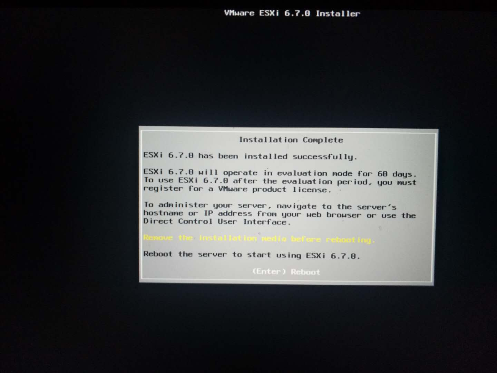

# deploy ESXI

部署ESXI6.7 至戴尔T7920塔式服务器．

## 简述

部署ESXI实现底层虚拟化，将服务器资源更加合理分配，并实现弹性伸缩等．

## 准备

本次使用光驱之来进行安装，请至官网自行[下载](<https://my.vmware.com/cn/web/vmware/evalcenter?p=free-esxi6>)ESXI iso文件,并按照[教程](<https://docs.vmware.com/cn/VMware-vSphere/6.7/vsphere-esxi-67-installation-setup-guide.pdf>)进行CD/DVD系统盘构建．

## 安装

### 创建RAID盘

1. 开机使用F12按键进入BIOS启动项选择画面：

2. 选择**OTHER OPTIONS**中的**Device Configuration**选项，进入下图画面：

3. 使用键盘方向键选择**Intel(R) RSTe STAT Controller**选项，进入如下画面，选择创建RAID卷：

4. 进入创建RAID卷画面

   当前画面需要进行一下操作：1. 输入创建的RAID卷名称（建议使用默认）2. 选择RAID等级（[等级详情](<https://en.wikipedia.org/wiki/Standard_RAID_levels>)）3. 选择需要进行创建的硬盘 4. 选择[**Strip Size**](<https://en.wikipedia.org/wiki/Data_striping>)以及**Capacity（MB）**(建议使用默认)

5. 操作完成进行创建，等候创建完成．至此可返回第三步查看RAID卷信息以及状态．

### 安装ESXI

在完成RAID卷设置之后可通过退出**Device Configuration**或重启机器通过F12进入BIOS启动选择画面（参见创建RAID盘第一步）．

1. 进入BOIS启动项选择画面，选择CD/DVD启动，进入ESXI选择画面

2. 选择完成之后进入加载页面
3. 加载完成后，ESXI开始进行硬件检查
4. 设备检查完成后进入欢迎画面，Enter 继续

5. 安装协议，使用F11进行确认

6. ESXI将进行磁盘扫描

   

7. 选择系统安装磁盘，Eneter 确认

8. 选择键盘布局,默认使用英文布局

9. 创建root用户密码，并确认密码
10. 最后确认安装，等待安装完成之后出现重启画面

最后取出光盘，重启机器，等待ESXI安装配置以及链接地址.

