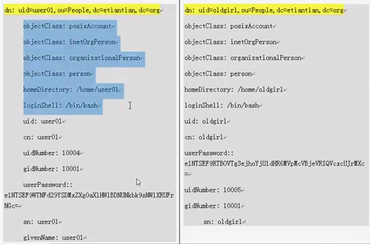
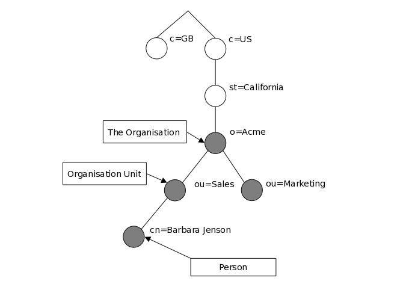
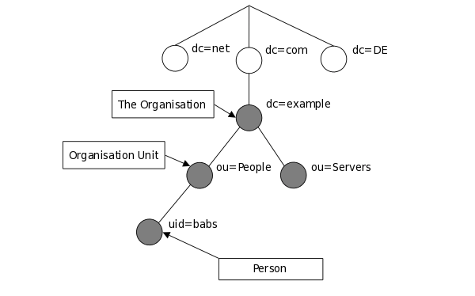
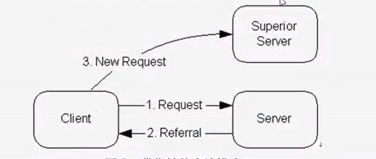
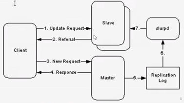

# LDAP Notes

## 简述
LDAP 是轻量级目录访问协议，应用场景为大规模搜索场景，没有很好的更新和聚合操作。
LDAP 基于TCP/IP协议或者其他的面向连接的传输服务。基于X.500协议

### X.500 

X.500 由ITU-T 和 ISO 定义，它实际上不是一个协议，而是由一个协议簇组成，包括 X.501 到 X.525 等一系列非常完成的目录服务协议。
    
从技术上说，LDAP 是一个到 X.500 服务的目录方位协议，X.500 是一个 OSI 录服务。最初 LDAP 客户端通过网关访问 X.500 目录服务，网关在客户端和网关之间运行 LDAP ,而 X.500 目录方位协议位于这个网关和 X.500 服务器之间。

DAP 是一个重量级的协议，在整个 OSI 协议上进行操作，并且需要占用大量的计算资源 
LDAP 被设计为在 TCP/IP 层操作，以最小代价实现大多数的 DAP 的功能。

单独的 LDAP 守护程序 openldap(slapd),可以被看作是一个轻量机的 X.500 目录服务器，也就是说它没有实现 X.500 完整的 DAP 协议。作为一个轻量级的目录读物，slapd 实现的仅仅是 X.500 模型的一个子集。

X.500 的主要特征：
+ 分散维护： 运行 X.500 的每个站点只负责本地目录部分，可以进行更新和维护操作。
+ 搜索性能： X.500 具有强大的搜索功能，支持用户建立的任意复杂查询。
+ 单一全局命名空间： 类似于 DNS, X.500 为用户提供单一同性命名空间。于 DNS 相比具有更灵活且易于扩展。
+ 结构化信息结构： X.500 目录中定义了信息结构，允许本地扩展。
+ 基于标准的目录服务： 由于 X.500 被用于建立一个基于标准的目录，因此某种意义上，请求应用目录信息的应用能访问重要且由价值的信息。 

### LDAP 于X.500 相同点

LDAP 是 X.500 标准的目录访问协议 DAP 的一个子集，可用于建立 X.500 目录，因此有许多的相同之处：
1. 在平台上都实现了一个通用的平台结构，提供了一个操作系统和应用程序需要的信息服务类型，可以被许多平台和应用程序接收和实现。
2. 在信息模型上，都是用了项、对象类、属性等概念和模式来描述信息。
3. 在命名控件方面，都是用了目录信息树结构和层次命名模型。
4. 在功能模型上，都是用了相似的操作命令来管理目录信息。
5. 再认证架构方面，都可以实现用户名称和密码或者基于安全加密方式的认证机制。
6. 在灵活性上，它们的目录规模可大可小，大到全球目录树，小到只有一台目录服务器。
7. 在分布性方面，目录信息都可以分布在多个目录服务器中，这些服务器可以由各组织管理，既保证目录信息总体结构的一致性，又满足了分级管理的需要。

### LDAP 于 X.500 不同点

1. LDAP 基于 TCP/IP 协议，X.500 基于 OSI 协议。
2. LDAP 协议更为简单。只保留常用的特性。
3. LDAP 通过引用机制实现分布式访问，X.500 DSA 通过服务器之间的链式操作实现分布式访问，这样查询的压力集中于服务器端；而 LDAP 通过客户端 API 实现分布式操作，平衡负载。
4. LDAP 实现具有低费用、易配置和易管理的特点，经过性能测试， LDAP 比 X.500 具有更少的效应时间，LDAP 提供了满足应用程序对目录服务所需要的特性。

### LDAP 的目录结构

LDAP 目录服务是通过目录数据库来存储网络信息，方便用户迅速查找华人定位，目录数据库是以目录信息树（directory nformation tree, 缩写为DIT）为存储方式的树形存储结构.

LDAP 安装树形结构组织，DIT 主要进行读操作的数据库

DIT 由条目（entry）组成，条目相当于关系数据库中的表的记录；

条目是具有分辨名DN(Distinguished Name)的属性-值对（attribute value,简称AV）的集合.

在UNIX 文件系统中，最顶层是跟目录（root）， LDAP 目录通常也用 root 作为跟目录，通常称为BaseDB.

因为历史（X.500）的原因，LDAP 目录用 OU (Organization Unit) 从逻辑上把数据分开， Ou也是一种条目----容器条目，Ou 的下面才是真正的用户条目。

## LDAP 目录结构相关术语

DN 分辨名/标识名（distinguished Name）

在LDAP 中，一个条目的分辨名叫做“DN”,DN 是该条目在整个树中的唯一名称标识，DN 相当于关系数据库表中的关键字（primary key）：它是一个识别属性，通常用于检索。

**DN 的两种设置**

基于cn (姓名)，最常见的 cn 是从`/etc/group` 中转出来的条目。

基于 uid(user ID), 常见的uid 是`/etc/passwd` 转来的条目。

**Base DN**

LDAP 目录树的最顶部就是根，也就是 Base DN。

**LDIF 格式** 

LDIF 格式是用于 LDAP 数据导入、导出的格式， LDIF 是 LDAP 数据库信息的一种文本格式。


### LDAP 信息模型

LDAP 的信息模型是基于条目的（entry），一个条目就是一些具有全局唯一的标识名的属性的集合．DN 用于无二性的指代一个唯一的条目．条目的没一个属性都有一个类型（type），一个或者多个值（value），类型往往是特定字符串的简写，比如：'CN' 指代 "common name"．以下是两个LDAP 中条目信息的例子，相当与数据库表中的两行记录：



其中蓝色示意区中:前半部分为属性（键），后半部分为变量（值）．LDAP 允许你通过一种叫做objectClass 的特殊属性来控制那些属性是条目所必须的，哪些条目可选的，objectClass 属性的值是由条目所必须遵从的方案（schema）来定义的．

通过以下命令获取上述案例内容：

```bash
ldapsearch -LLL -w oldboy -x -H ldap://IP -D "cn=admin,dc=domain,dc=com" -b "dc=domain,dc=com" "uid=*"
```

### LDAP 目录逻辑结构原理介绍

LDAP 中，条目是按树状的层次结构组织的．传统上，这个结构往往是地理界限或之组织界限的反映．代表国家的条目位于整个目录树的顶层．之下的条目代表各个州以及国家性的组织，再下面的条目则代表组织单位，个人，打印机，文件，或者你所能想到的其他东西．传统命名方式组织的 LDAP 目录信息树：



LDAP 还支持按照因特网来安排树，这种命名方式正变的越来越流行，因为它允许使用DNS 定位目录服务．以下为基于域的命名示例：



### 信息引用

一个条目是通过它的标识名来引用的．而标识名是有相对标识名（Relative Distinguished Name 或者RDN）和它的父亲条目名连在一起构成的．比如：在因特网命名的例子中，Barbara Jenson 条目有相对标识名 uid=babs 和绝对标识名为 uid=babs,ou=People,dc=example,dc=com．

### 信息访问

LDAP 定义了一组查询和更新目录的操作．支持的操作包括从目录中添加和删除条目，更改已有的条目，更改已有条目的名字．然而，大多数情况下 LDAP 使用与搜索目录中的信息．通过指定搜索过滤器，LDAP 可以在目录的相关部分搜索相符的条目，满足过滤条件的每一个条目都能收到请求信息．

比如：你可能想搜索位于 dc=example,dc=com 目录子树下的叫 Barbara Jenson 的人的条目．并获取找到的每个条目的 email 地址．LDAF 可以让你轻松的完成这一切．

### 信息保护

一些目录服务不提供保护，允许信息对任何人可见．LDAP 提供里一套机制来对客户进行身份确认，或者让客户证明它拥有链接到服务器的身份，对服务器进行全方位的访问控制提供了基础，确保服务器上所包含信息的安全．LDAP 也支持 privacy 和 integrity 的安全服务．

## LDAP 数据文件介绍

### 目录数据文件内容详情

LDIF(LDAP Data Interchange Format) 轻量级目录交换格式，一种 ASCii 文件格式，用来交换数据并使得在 LDAP 服务器间交换数据成为可能．

LDIF 文件常用的功能就是像目录导入或者修改信息，这些信息的格式需要按照 LDAP 中的架构(schema/模式)格式组织，如果不符合其要求的个是就会出现错误．

```
ldapsearch -LLL -w oldboy -x -H ldap://localhost -D "cn=admin,dc=domain,dc=com" -b "dc=domain,dc=com" "uid=*"
```


**LDIF 文件特点**：

+ 通过空行来分割一个条目或者定义
+ 以 # 开始的行为注释
+ 所有属性的赋值方法: "属性：值"
+ 属性可以被重复赋值，例如：objectClass 就有多个，每个属性及属性值独立一行
+ 每行的结尾不能有空格

**注**：LDIF 格式是 openldap 2.3/centos5.8 yum 的格式

在LDAP 中的每条记录中必须包含一个 objectClass 属性，且其需要赋予至少一个值，objectClass 属性有等级之分，LDIF 里面属性相当与变量，它可以被自定义赋值，值不能相同，相当与 shell 里的 a=1 的定义．

### LDAP 工作流程

LDAP 目录服务基于客户端/服务器模式，一个或者多个LDAP 服务器包含这组成整个目录信息树（DIT）的数据，LDAP 客户端链接到服务器并且发出一个请求（request），然后服务器要么以一个回答（answer）进行返回，要么给出一个指针，客户端可以通过指针再次进行获取到所需要的数据（通常该指针是指向另一个LDAP 服务器）．无论客户端连到哪个LDAP 服务器，它看到的都是同一个目录视图（view）.这是 LDAP 这类全局目录服务的一个重要特征．

### LDAP 几个重要配置模式

LDAP 服务的几个重要功能：

+ 基本的目录查询服务
+ 目录查询代理服务
+ 异机复制数据（主从同步）

#### 本地基本的目录查询服务

在这种配置模式下，你的slapd 只为你的本地域提供目录服务．它不会以任何方式与别的目录服务器进行交互，示例图：


#### 目录查询代理服务（带有指针）

在这种配置模式下，为你的本地域运行一个 LDAP 服务器，并且将它配置成为当客户端的请求超出本地服务器的处理能力的时候能够返回一个指针，该指针指向一个具备处理客户请求能力的更高级服务器的地址．可以自己运行这一服务，也可以使用别人以提供的．示例图：



#### 主从同步

slurpd 守护程序是用来将主 slapd 上的改变传播到一个或多个从属的 slapd 上，一个master-slave 类型的配置如下图：



这种配置模式可以和前面的两种配置模式之一合起来使用，在前面的两种情况中，单独的slapd 不能提供足够的可用性和可靠性．

#### 简单易用的同步复制目录方案

利用 inotify+ldap 客户端命令方案，或者通过定时任务加上 ldap 客户端命令方案．

**inotify + ldap**

部署一个 inotidy 服务监控 master 数据文件，只要变化就调用rsync 命令推送数据至 slave.

**定时任务**

通过定时任务．定期将数据进行发送同步．

#### 分布式的目录服务

在这种配置模式下，本地的服务本分割成更多个小的服务，没一个都可能被复制，并且通过上级（superior）或者下级（subordinate）指针（referral）粘合起来．跨机房通过openvpn同步．

LDAP 企业架构逻辑图案例：ldap+haproxy/nginx/heartbeat 集群高可用，验证的时候尽量不跨机房．以防延迟，链接错误等．


## LDAP 服务的企业应用领域和开源软件

LDAP 目录服务，适合需要从不同的地点读取信息，但是不需要经常更新的业务信息最为常用．

LDAP 主要涉及一下类型：

- 信息安全类：数字证书管理，授权管理，单点登录
- 科学计算类：DCE(Distributed Computing Enviroment,分布式计算环境)，UDDI(Universal Descripion, Discovery and Intergration,统一描述，发现和集成协议)
- 网络资源管理类：MAIL 系统，DNS 系统，网络用户管理，电话号码簿
- 电子政务资源管理类：内网组织信息服务，电子政务目录体系，人口基础库，法人基础库．

LDAP 常见开源产品

[OpenLDAP](www.openldap.org)


## LDAP 搭建环境需求

LDAP 服务对系统环境要求不高，但在生产环境中，应该最少是两台，将单点问题影响业务的几率降低．

以下示例在CentOS 6.4 环境下搭建

### ldap master 服务安装

#### 安装前系统环境准备

1. 检查系统版本信息

   ```bash
   cat /etc/redhat-release
   ```

2. 查看内核信息

   ```bash
   uname -r
   ```

3. 查看系统架构

   ```bash
   uname -m
   ```

4. 配置 yum 源

   CentOS 根据版本不同，拥有不同的方式，当前是 6.8 版本的案例：

   ```bash
   cd /etc/yum/repos.d/
   /bin/mv CentOs-Base.repo CentOS-Base.repo.backup
   wget http://mirrors.163.com/.help/CentOS6-Base-163.repo
   /bin/mv CentOS6-Base-163.repo CentOS-Base-repo
   ```

5. 关闭Selinux 

   ```bash
   getenforce # 查看状态
   setenforce 0 # 临时关闭
   ```

6. 关闭防火墙

   ```bash
   /etc/init.d/iptables stop # 关闭防火墙
   /etc/init.d/iptables status # 查看状态
   chkconfig iptables off
   
   ```

7. 时间同步(重要)

   ```bash
   /usr/sbin/ntpdate IP| domain
   crontab -e # 添加定时同步，将以下内容填写至定时任务
   */5 * * * * /usr/sbin/ntpdate domain > /dev/null 2>&1
   ```

   设定完成使用以下命令查看定时任务是否成功：`crontab -l`　

8. 设定 LDAP 域名

   添加DNS 解析地址到`/etc/hosts`文件：

   ```bash
   echo "[IP Address] [domain]" >> /etc/hosts
   ```

   检查`hosts`是否有写入内容：

   ```bash
   tail -1 /etc/hosts
   ```

   使用`ping`再次检查域名解析是够正确配置：

   ```bash
   ping　domain # 此为上述添加至hosts文件中的域名 
   ```

#### 安装 LDAP

```bash
yum -y install openldap openldap-* --skip-broken
yum -y install nscd nss-pam-ldapd nss-* pcre pcre-* --skip-broken
```

如出现以下错误：

```
You could try using --skip-broken to work around the problem.
You could try running : rpm -Va --nofiles --nodingest.
```

单独安装`nss-*`:

```bash
yum install nss-* -y 
# or
yum install nss -y
```

```bash
# 更新
yum update nss-softokn-freebl
# 安装
yum install nss-* -y 
```

**注**：OpenLDAP 2.3 的配置文件为`/etc/openldap/slapd.conf`,而2.4 的配置文件在`/etc/openldap/slapd.d/en=conf`下。而 `slapd.conf` 可以支撑两个版本的使用。

#### 配置管理员密码

使用 `slappasswd` 命令设置密码，首先使用`slappasswd -h` 查看帮助文档。其中 `-s`选项为设置密码，在参数后直接指定密码，此命令将返回加密后的密码。

同时 `slappasswd` 命令不带参数执行默认也可以执行设置密码。但需要在命令行中按照提示进行输入。

有关 OpenLDAP 2.3 和 2.4 版本配置文件以及数据格式的区别，参考 OpenLDAP [官方说明](http://www.openldap.org/doc/admin24/slapdconf2.html)


#### 配置 LDAP 其他关键参数

备份现有配置文件：

```bash
cp slapd.conf slapd.conf.backup
```

完成备份文件后编辑 LDAP 配置文件:

```bash
vim slapd.conf
```

注释掉以下信息：

```conf
database    bdb
suffix      "dc=my-domain,dc=com"
checkpoint  1024 15
rootdn      "cn=Manager,dc=my-domain,dc=com"
```

注释完成后，在以上内容后添加一下信息：

```conf
database    bdb
suffix      "dc=domain,dc=com"
rootdn      "cn=admin,dc=domain,dc=com"
```

**提示**： 配置文件中的先后位置不要随意动，空行和“#”开头的注释行将被忽略，如果一行以空格开头，它将被认为是接着前一行的（即使前一行是注释）。

#### 检查所修改的配置

使用 `diff` 命令对比修改前和修改后的文件：

```bash
diff slapd.conf.backup slapd.conf
```

#### 更多 LDAP 参数配置

+ 日志及缓存配置优化
    ```conf
    loglevel    296
    # 日志级别
    cachesize   1000
    # 缓存的记录数
    chechpoint  2048    10
    # 文件达到2048K，或者每十分钟进行回写
    ```

+ 授权及安全参数配置

  参考[官方文档](http://www.openldap.org/doc/admin24/access-control.html)

#### 配置syslog记录LDAP日志

配置 rsyslog 记录LDAP 服务日志，默认级别为256:

+ 备份 rsyslog 配置文件

  ```bash
  cp /etc/rsyslog.conf /etc/rsyslog.conf.backup
  ```

+ 使用 echo 命令添加配置至配置文件

  ```bash
  echo "#record ldap.log by oldboy 2012-03-01" >> /etc/rsyslog.conf
  echo "local4.* 		var/log/ldap.log" >> /etc/rsyslog.conf
  ```

+ 查看 配置文件修改情况

  ```bash
  tail -1 /etc/rsyslog.conf
  ```

+ 重启 rsyslog 

  ```bash
  /etc/init.d/rsyslog restart
  ```

  

#### 配置数据目录

```bash
cp /usr/share/openldap-servers/DB_CONFIG.example /var/lib/ldap/DB_CONFIG
```

CentOS 5.8 的系统下，上述DB_CONFIG.example 文件在`/etc/openldap` 下，6.4 的在上述命令路径下．

**修改文件权限**：

```bash
chown ldap:ldap /var/lib/ldap/DB_CONFIG
chmod 700 /var/lib/ldap
ls -l /var/lib/ldap
```

#### 测试

执行 `slaptest -u` 命令，如出现配置文件测试成功，则为配置完成．

#### 启动

```bash
/etc/init.d/slapd restart
```

完成以上命令后，检查是否启动成功：

```bash
lsof -i :389
ps -ef | grep ldap | grep -v grep
```

**开机自启动**

```bash
chkconfig slapd on
```

检查是否配置成功：

```bash
chkconfig --list slapd
```


#### 查询测试

执行以下命令，进行查询测试：

```bash
ldapsearch -LLL -W -x -H ldap://test.com -D "cn=admin,dc=test,dc=com" -b 'dc=test,dc=com' "(uid=*)"
```

首次执行出现没有项目提示为运行正常，如出现错误，请尝试以下解决方案：

解决 LDAP 2.3 和 2.4 的配置问题：

```bash
rm -rf /etc/openldap/slapd.d/*
slaptest -f /etc/openldap/slapd.conf -F /etc/openldap/slapd.d
chown -R ldap:ldap /etc/openldap/slapd.d/
/etc/init.d/slapd restart
lsof -i :389
```

### 添加数据的方式

+ 根据 LDAP 数据文件格式编写并导入数据

  **注**：此种方式理解比较复杂，但是操作简单．

+ 根据系统用户及 LDAP 自带的脚本来初始化数据

  添加测试用户 `test`，配置用户登录环境

  ```
  groupadd -g 5000 test
  useradd -u 5001 -g 5000 test
  ```

  创建根项，并使用 openldap-servers 自带的脚本生成和导入 passwd/group 配置：

  ```bash
  grep test /etc/passwd >> passwd.in
  grep test /etc/group > group.in
  ```

+ 通过 LDAP 客户端工具进行初始化数据

  适合初学者学习掌握．参考**LDAP 可视化管理**．

+ 已有数据进行导入

  ```
  ldapadd -x -H ldap://test.com -D "cn=admin,dc=test,dc=com" -W -f filename.ldif 
  ```

  -H：链接地址

  -D: DN

  -f：文件名称

  -w：携带密码，不用交互输入

#### LDAP 可视化管理

LDAP 的客户端接口有很多，有B/S的，也有C/S的，此示例为B/S结构的 LDAP-account-manager：

```bash
yun install httpd php php-ldap php-gd -y
```

完成以上安装步骤后，执行以下命令检查安装文件：

```bash
rpm -qa httpd php php-ldap php-gd
```

**下载**

前往[ldap-account-manager](https://www.ldap-account-manager.org/lamcms),目前较为稳定的为 3.7 版本，所以此示例使用的为 3.7 版．

下载完成之后，将安装文件上传之服务器`/var/www/html`下．并解压．

**配置**

进入 `/var/www/html` 目录下：

```bash
cd ldap-accound-manager/config
# 备份原有配置文件
cp config.cfg_sample config.cfg
cp lam.conf_sample lam.conf
# 修改配置
sed -i 's#cn=Manager#cn=admin#g' lam.conf
sed -i 's#dc=my-domain#dc=domain#g' lam.conf
sed -i 's#dc=com#dc=com#g' lam.conf
chown -R apache:apache /var/www/html/ldap-accound-manager
```


## 配置应用使用 LDAP 身份验证

### 前提

+ LDAP 服务端需要有用户
+ 更改 saslauthd 的下配置的 MECH=ldap
+ 创建 saslauthd 的配置文件，添加 LDAP 配置信息 

### 配置 svn+sasl 用过 LDAP 身份验证

+ 安转 svn 并配置

+ 启用 svn 服务器的 sasl 验证机制

  SASL 全称简单的身份验证和安全层（Simple Authentication and Security Layer），是一种用来扩充 C/S 模式验证能力的机制．

  SASL 是一个胶和(gule)库，通过这个库把应用层，与形式多样的认证系统整合在一起．有点类似与 PAM ，当时后人是认证方式，决定什么人可以访问什么服务，而 SASL 是认证过程，侧重与信任建立过程，这个过程可以调用 PAM 来建立信任关系．在这里 Memcached 就是上面提到的应用层，具体的认证过程交给 SASL 库完成．

  默认情况下，Red Hat Enterprise Linux 安装程序会自动安装 Cyrus-SASL 认证包．可使用以下命令测试系统是否已经安装了 Cyrus-SASL 认证包：

  ```bash
  rpm -qa | grep sasl
  ```

  如有输出则表示以安装，但为了确保安装完整，需要再次执行安装命令：

  ```bash
  yum install *sasl* -y
  ```

  查看可认证列表：

  ```bash
  saslauthd -v
  ```

  输出中有 ldap 即完成．

+ 查找调整认证机制文件

  ```bash
  grep -i mech /etc/sysconfig/saslauthd
  ```

+ 替换认证方式，使用本地 shadow 认证

  ```bash
  sed -i 's#MECH=pam#MECH=shadow#g' /etc/sysconfig/saslauthd
  ```

  修改完成使用以下命令检查文件是否修改完成：

  ```bash
  grep -i mech /etc/sysconfig/saslauthd
  ```

+ 重启 sasl

  ```bash
  /etc/init.d/saslauthd restart
  ```

+ 测试本地认证

  ```bash
  testsaslauthd -u username -p password
  ```

  输出 `OK Success`即为成功．如出现`No "authentication failed"`，请检查当前系统是否存在用户．

+ 修改使用 LDAP 认证

  使用 `man` 命令查看 saslauthd 配置说明：

  ```bash
  man saslauthd
  ```

  搜索 LDAP 关键词，查看关于配置 LDAP 方式说明．

  然后使用 `sed` 命令再次替换其中的认证方式:

  ```
  sed -i 's#MECH=shadow#MECH=ldap#g' /etc/sysconfig/saslauthd
  ```

  通过`grep -i mech /etc/sysconfig/saslauthd`命令再次检查修改情况．之后重启服务．

  ```bash
  /etc/init.d/saslauthd restart
  ```

  由于 saslauthd.conf 文件默认隐藏，需要自己创建`vim /etc/saslauthd.conf`:

  ```conf
  # saslauthd.conf
  ldap_servers: ldap://domain.com # 最好使用域名
  ldap_bind_dc: cn=admin,dc=domain,dc=com # 管理员dn,注意替换域名
  ldap_bind_pw: passwd # 管理员密码
  ldap_search_base: ou=People,dc=domain,dc=com
  ldap_filter:uid=%U
  ldap_password_attr: userPassword
  ```

  编辑完成之后退出保存，并使用 `testsaslauthd` 测试认证：

  ```bash
  testsaslauthd -u ｕsername -p password
  ```

  出现 `OK "Success."`即为成功．

+ 安装SVN

+ 配置SVN 通过 LDAP 认证

  创建 `/etc/sasl2/svn.conf` 文件，填写以下内容：

  ```
  pwcheck_method: saslauthd
  mech_list: PLAIN LOGIN
  ```

  修改svn配置文件`svnserve.conf` :

  ```bash
  sed -i 's@# use-sasl = true@use-sasl = true@g' svnserve.conf
  ```

  关闭svn（pkill svnserve） ，使用以下命令进行重启：

  ```bash
  svnserve -d -r /path/to/svndata
  ```

