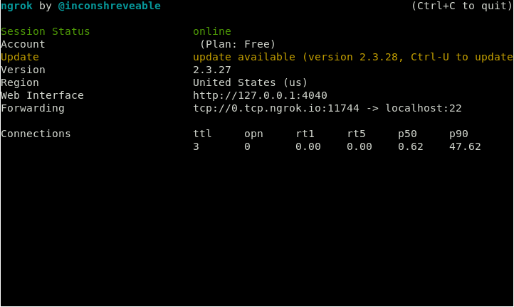

##### 0507

CentOS删除Python后无法使用yum，需要重新安装Python．进行环境修复．

如果在不能使用后，通过编译安装Python环境，需要清理干净．

首先进行测试，确认系统环境中的Python环境损坏程度：

1. yum出现问题

   ```
   [root@test~]# yum
   -bash: /usr/bin/yum: No such file or directory
   ```

2. Python 出现问题

   ```bash
   [root@test ~]# yum
   -bash: /usr/bin/yum: /usr/bin/python: bad interpreter: No such file or directory
   [root@test ~]# python -V
   -bash: /usr/bin/python: No such file or directory
   ```

在确定只是yum出现问题的情况下，只需要修改`/usr/bin/yum`文件中的第一行，指定python版本即可．此问题一般为Python版本升级所造成．

如果在两者都没有的情况，需要执行一下步骤：

在同样系统的服务器上使用`yumdownloader`　命令，将rpm包下载下来，然后转移到这个服务器上，如果没有yumdownloader，使用`yum install yum-utils`进行安装，然后下载以下的包：

```bash
yumdownloader  python python-libs python-devel python-devel python-pycurl python-urlgrabber python-setuptools rpm-python yum-utils yum yum-metadata-parser yum-plugin-aliases yum-plugin-protectbase yum-plugin-fastestmirror python-kitchen python-chardet
```

将以上下载rpm文件转移之后，就需要安装rpm包了：

```bash
[root@test ~]# rpm -Uvh --replacepkgs python*.rpm
[root@test ~]# rpm -Uvh --replacepkgs rpm-python*.rpm yum*.rpm
```

如果出现依赖关系需要安装其他的rpm，不能跳过，必须安装，需要按照提示进行查找下载，并使用rpm命令独立安装（rpm -Uvh --replacepkgs ［需要安装的包文件名称］）．

完成以上步骤就可以测试Python环境以及yum使用了．


##### 190508

supervisor出现`pkg_resources.DistributionNotFound: meld3>=0.6.5`错误，需要重新安装setuptools，然后再次安装supervisor即可．


##### 190510

ngrok　代理ssh 步骤：

打开[ngrok官网](https://ngrok.com)，登录帐号（可使用GitHub和Google登录），默认跳转至个人页面，按照个人页面提示进行下载，安装，以及本地登录ngrok认证信息．

代理ssh:

运行命令：

```bash
./ngrok tcp 22
```

出现如下图内容：



复制图中`Forwarding`项的地址，作为ssh链接地址，端口为链接代理端口，链接案例：

```
ssh -p port username@0.tcp.ngrok.io
```


frp 代理ssh:

登录[frp发布页](<https://github.com/fatedier/frp/releases>)，在服务端以及客户端分别下载与系统对应的源码，解压，然后进入项目目录.

服务端：

编辑`frps.ini`文件，可自行修改绑定地址，然后保存退出．

```ini
# frps.ini
[common]
bind_port = 7000
```

后执行一下命令启动 frp 服务端：

```bash
./frps -c ./frps.ini
```


客户端:

注：客户端需要在内网之内

编辑`frpc.ini`，在`[common]`项中填写服务端 IP 地址以及运行端口．在`[ssh]`中填写链接类型，需要映射的 IP 地址，端口，最后一项为本地的端口映射在服务端的端口：

```ini
[common]
server_addr = x.x.x.x
server_port = 7000

[ssh]
type = tcp
local_ip = 127.0.0.1
local_port = 22
remote_port = 6000
```

启动客户端：

```bash
./frpc -c ./frpc.ini
```


完成以上步骤即可通过服务端 IP 链接内网机器，示例如下：

注： 链接的端口为客户段`frpc.ini`配置文件中`[ssh]`项填写的`remote_port`.

```
ssh -p 6000 username@server_IP
```


##### 190513


##### 190520

安装 mysql ,　VPN 服务器地址 95.179.176.72 ，root 默认密码为：14253678

链接账户：sunxr, 密码：sunxr123

修改用户登录密码常用语句：`alter user 'root'@'localhost' identified by 'new-passwd'`

上述命令修改完成，执行权限刷新命令．

编辑 mysql 配置文件`/etc/mysql/mysql.conf.d/mysqld.cnf`，允许远程访问，将bind_addrs　一行注释．


ubuntu18.04 install mysql 5.7

1. 安装 MySQL ：

   ```bash
   sudo apt install mysql-server
   ```

2. 配置MySQL ：

   ```bash
   sudo mysql_secure_installation 
   ```

   第一个询问为是够设置验证码插件，该插件用于测试 MySQL 密码的强度．无论如何选择，下一步都是为 MySQL 设置 root 用户设置密码，输入然后确认你选择的安全密码．

   从这之后就可以按 Y ，然后接受所有后续问题的默认值．这将删除一些匿名用户和测试数据库，禁止 root 远程登录，并加载这些规则．

3. 调整用户身份验证和权限：

   登录 MySQL 

   ```bash
   sudo mysql
   ```

   查看 MySQL 用户帐号使用的身份验证方式：

   ```sql
   select user,host,authentication_string,plugin　from mysql.user;
   ```

   在首次登录使用此命令查看，root 用户的 authentication_string 列应为空，plugin 列显示为 auth_socket．root 用户实际上使用的是 auth_socket 插件进行身份验证，执行一下命令，修改为使用密码进行身份验证：

   ```sql
   alter user 'root'@'localhost' identified with mysql_native_password by 'password';
   ```

   修改完成之后，执行加载权限，使其修改生效：

   ```sql
   flush privileges;
   ```

   完成以上命令之后，再次检查每个用户的身份验证方式确认 root 用户不再使用 auth_socket 插件进行验证：

   ```sql
   select user,host,authentication,plugin from mysql.user;
   ```

4. 创建远程链接用户并赋予权限：

   创建一个用户并设置密码：

   ```sql
   create user 'username'@'%' identified by 'password';
   ```

   赋予用户适当权限，当前示例为赋予全部表的权限以及添加，删除和修改用户的权限：

   ```sql
   grant all privileges on *.* to 'username'@'%' with grant option;
   ```


##### 190523

卸载 Playonlinux 

```
sudo apt purge playonlinux
sudo apt autoremove
sudo apt autoclean
```


安装wine

```
sudo dpkg --add-architecture i386
wget -qO- https://dl.winehq.org/wine-builds/winehq.key | sudo apt-key add  - 
sudo apt-add-repository 'deb http://dl.winehq.org/wine-builds/ubuntu/ bionic main'

```


卸载 wine 和 playonlinux

```
sudo apt purge wine* playonlinux* 
sudo apt autoremove
rm -rf ~/.wine ~/.Playonlinux

```


安装　bcloud 私人写的一个百度网盘的ｕbuntu 客户端，

```bash
sudo apt install bcloud
```

等待安装完成，执行`bcloud-gui`启动．

出现以下报错：

+ 没有 bcloud 模块，解决：使用pip search 搜索当前名称，找到描述相符的进行安装．
+ 没有 gi 模块，解决：使用 conda 进行安装 `conda install -c conda-forge pygobject`

+ 导入错误，gi 模块没有GDK．没有解决，放弃


使用 [deepin-wine-ubuntu](<https://github.com/wszqkzqk/deepin-wine-ubuntu>)：

```
# 在线安装
wget -qO- https://raw.githubusercontent.com/wszqkzqk/deepin-wine-ubuntu/master/online_install.sh | bash -e
```

安装完成之后，自己下载发布的deb包，使用dpkg -i 进行直接安装就可以使用了．


本地　redmine　密码：　yuhan123456 

ubuntu 18 install ldap

```bash
sudo apt install slapd ldap-utils
```

上述命令需要配置管理员密码．

完成之后需要修改默认目录树信息，执行以下命令重置配置：

```
sudo dpkg-reconfigure slapd
```

第一个问题选择否（省略初始配置），然后设置DNS 名称，然后系统将要求配置组织名称，然后输入管理员密码进行确认．完成之后选择MDB 作为数据库后端，然后选择No 在清楚slapd 时删除数据库．最后选择Yes 以移动旧数据库．

