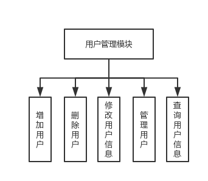
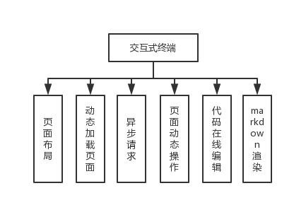
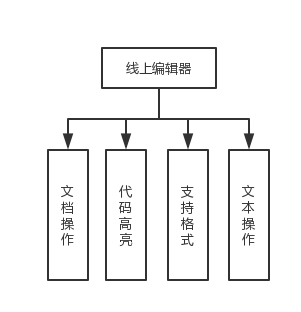
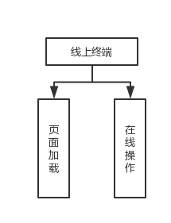
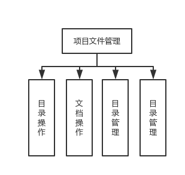
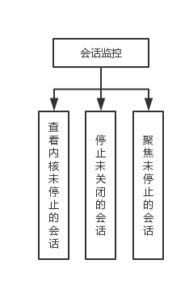
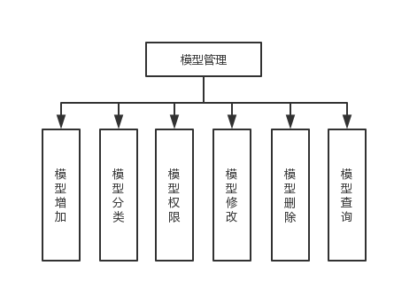
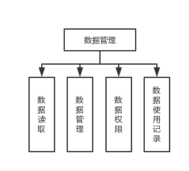
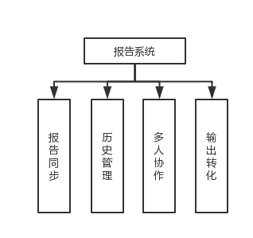

## SGDASS功能概要

### 1	概述

​	本文档式《数据分析服务平台》的概要设计和实现说明，包括程序系统的基本处理流程、程序的组织机构、模块划分等。

### 2	项目简要介绍

#### 2.1 目标

​	主要开展一般性统计分析、描述性分析，以及调用固化模型进行分析结果的输出。 数据分析人员工作涉及到分析的执行与报告编写，在分析执行的过程中也会对结果进行可视化设计，用于报告信息的有效传达

#### 2.2 系统管理

1. 系统模式

2. 系统开发环境: ubuntu

3. 数据库管理系统

   

#### 2.3 功能概述 

1. 简述

   以计算型叙述为核心交互式分析环境，像用户提供基于B/S架构的数据分析功能。主要表现形式为用户可在Web 端进行分析代码编写，运算由服务端进行，并在Web进行结果展示。

   实现系统和操作人员的一问一答，直至获得最后处理结果，具有灵活、直观、便于控制等优点。在以交互式分析环境为基础，增加模型[^模型]管理，实现复用，增加效率，减少过度的重复劳动。

2. 主要模块

   用户管理模块：实现对用户的管理、权限认证等。

   交互式计算：为用户提供交互式分析环境，实时计算，实时渲染等。

   文档管理：为用户提供文档管理，排版等。

### 3	系统功能设计

#### 3.1	简述

​	支持多用户，允许用户拥有自己的工作空间。基于浏览器的工具，用于交互式创作文档，其中包含解释性文本，数学，计算及其富媒体输出。 并通过是使用卡和拆分器在工作区域中并排排列多个文档和活动。

#### 3.2	基本设计思想

   3.2.1	系统采用模块化程序设计方法，既便于系统功能的各种组合和修改，又便于技术维护人员补充与维护。

   3.2.2	系统应具备数据库维护功能，及时根据用户需求进行数据的添加、删除、修改、备份等操作

   3.2.3	系统采用B／S体系结构。

#### 3.3	基本模块

3.3.1 用户管理模块

1. 功能描述

   对用户进行权限管理，确认用户的工作空间。从而保证系统和数据的安全，以及授权访问者的合法利益。

2. 模块功能图

   

3.3.2 交互式终端

1. 功能描述

   ​	使用人员可以边设计，边调整，边修改，使错误和不足之处及时得到改正和补充 ，系统能提供提示信息,逐步引导操作者完成所需的操作,得出处理结果。

2. 模块功能图

3.3.3 线上编辑器

1. 功能概述

   ​	支持多种格式的文档编辑，支持源代码的语法高亮显示和自动渲染。支持编辑器常见操作。

2. 模块功能图

   

3.3.4 线上终端

1. 功能概述

   ​	为用户提供终端，用户通过终端操作可自定义分析环境。

2. 模块功能图

   

3.3.5 项目文件管理

1. 功能概述

   ​	对目录的结构和管理以及文档的管理，使你可以使用系统上的文件和目录。

2. 模块功能图

   

3.3.6 会话监控

1. 功能概述

   ​	查看当前未关闭的会话，并拥有重新打开和聚焦链接到给定内核或终端的窗口

2. 模块功能图

   

3.3.7 模型管理

1. 功能描述

   ​	通过对模型的固化管理，对模型性进行独立的增删改查，实现模型的复用，增加效率。通过模型的权限管理，实现模型的分享，增加效率。

2. 模块功能图

   

3.3.8 数据管理

1. 功能描述

   ​	权限设置，明确数据的可使用范围以及授权使用，确保数据的安全性。

2. 模块功能图

   

   

3.3.9 报告系统

1. 概述

   ​	报告系统用于生产专业分析报告或其他专业文档的线上编辑环境。模板中输入仅需要以纯文本输入相关内容， 格式处理与排版由 L ATEX 和所用模板负责处理。 Markdown 与 LaTeX 作为报告系统的文本编辑语言使用场景有所不同，轻量级标 记语言用于日常非正式的文档生产，LATEX 用于正式的文档出版物的生产。系统应提供转换机 制使两种格式的文本相互之间可进行转换。

2. 模块功能图

   

### 4 接口设计

1. 外部接口
2. 内部接口
3. 用户接口

### 5 数据结构

1. 逻辑结构
2. 物理结构

[^模型]: 单个功能化的代码片段