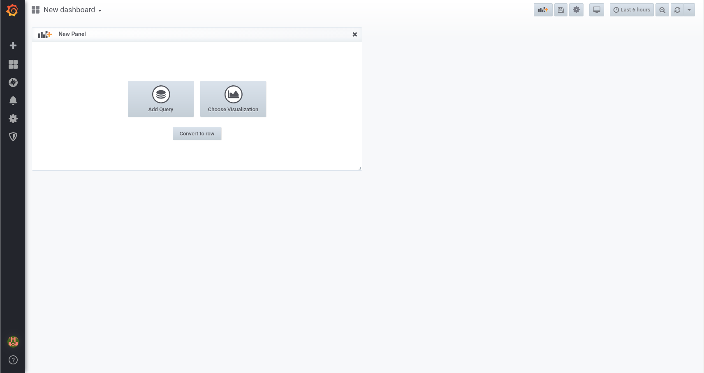

# grafana

使用 grafana v6.2.1记录．

## 部署

当前使用 Grafana docker 镜像进行测试使用以及练习，使用以下命令获取 Grafana docker 镜像：

```
docker pull grafana/grafana
```

由于是测试使用，所以运行容器不进行宿主机数据卷持久话保存，只进行端口映射，将服务暴露与宿主机上：

```shell
docker run -d --name grafana -p 3000:3000 grafana/grafana
```

并使用 -d 参数后台运行，不进行日志输出．但关机之后容器会停止运行，如需恢复上次测试使用容器，请执行以下命令，再次运行 Grafana 测试使用容器．

```bash
docker start grafana
```


 ## 使用

打开浏览器访问 `http://localhost:3000`， 将看到登录界面，首次登录需要重置管理员 `admin`用户密码，默认密码为 `admin`，个人修改为 `142536`．

### 添加数据源

登录完成后，在创建地一个仪表板之前，需要添加数据源，将光标移动到侧面菜单上的 Configuration(齿轮图标) ，它将显示配置菜单。如果侧面菜单不可见，单击左上角的 Grafana 图标。配置菜单上的第一项是数据源，单击它，将进入数据源页面，可以在其中添加和编辑数据源．

1. 单击添加数据源（绿色按钮）
2. 选择需要添加的数据源类型（数据库类型）
3. 填写数据库链接信息

参照[PostgreSQL数据源选项](<https://grafana.com/docs/features/datasources/postgres/#data-source-options>) ，其中需要注意的是 **SSL Mode** 选项需要注意，当前测试使用选择的是**disable** ．选择其中`verify-ca` 选项在点击保存和测试按钮会在按钮上方出现错误`509: certificate signed by unknown authority`， 选择其中`verify-full` 选项在点击保存和测试按钮会在按钮上方提示错误`x509: cannot validate certificate for 139.224.9.212 because it doesn't contain any IP SANs`．

只有`disable` 以及`require` 选项在点击保存和测试按钮会在按钮上方出现 `Database Connection OK` 提示．

### 创建新的仪表板

将光标移至左侧菜单栏 Create(加号) 图标，它将显示添加仪表版菜单．点击 Dashboard 选项出现以下画面：



最顶部标题功能依次为：

1. 侧面菜单栏切换(grafana图标)：这会切换侧面菜单，使您可以专注于仪表板中显示的数据。侧边菜单提供对与仪表板无关的功能（如用户，组织和数据源）的访问。
2. 仪表板下拉菜单（四个方块图标+New dashboard[仪表板名称]）：此下拉列表显示您当前正在查看的仪表板，并允许您轻松切换到新的仪表板。您还可以在此处创建新的仪表板或文件夹，导入现有仪表板以及管理仪表板播放列表。
3. 添加面板（柱状图+加号图标）：将新面板添加到当前仪表板
4. Star Dashboard(五角星图标)：Star（或unstar）当前仪表板。默认情况下，加星标的仪表板将显示在您自己的主页控制台上，是标记您感兴趣的仪表板的便捷方式。
5. 共享仪表板（共享图标）：通过创建链接或创建其静态快照来共享当前仪表板。确保在共享之前保存仪表板。
6. 保存仪表板（磁盘图标）：当前仪表板将与当前仪表板名称一起保存。
7. 设置（齿轮图标）：管理仪表板设置和功能，如模板和注释，。
8. 循环视图模式（电脑屏幕图标）：全窗口查看仪表板．并提供定时，时间段等．
9. 时间选择框（钟表图标+时间内容）：为循环视图模式提供时间选择功能．
10. 时间范围缩小（放大镜图标）：缩小时间范围按钮，同时也支持使用快捷键 **Ctrl + z** 进行操作．
11. 刷新和定时（循环双箭头+倒置三角形）：刷新当前页面，获取新数据．并可设置定时刷新，通过点击定时按钮（倒置三角形图标）选择自动刷新时间．

#### 仪表板设置

当前测试使用，修改了以下内容：

点击设置按钮，其中选项包括以下内容：

+ General : 设置仪表板的基础信息．当前仪表版名称，详情描述，标签，文件夹，是否可编辑以及时间刷新选项．
+ Annotations:  注释设置，这是
+ Variables: 变量设置
+ Links
+ Versions : 当前仪表板的所有修改历史．
+ Permissions: 当前仪表板的权限管理
+ JSON Model : 定义仪表板的数据结构。包括设置，面板设置和布局，查询等。

进行配置仪表板信息，只修改名称为 test ，点击保存，弹出提示框，可填写此次修改内容备注，再次点击保存，即可修改成功，所有的修改记录都可设置中的历史项进行查看．

#### 仪表板展示

在创建


